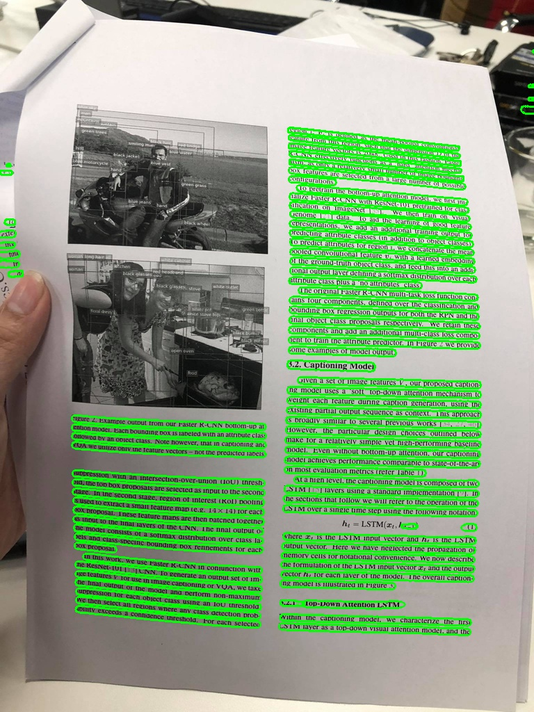

# LSM: Line Segmentation Model for documented text with multi orientations

## Quick Start

One image demo:
```
python demo.py -t single -i <path-to-image> -o <output-directory> -d <device (Default=cpu)> 
```

Whole directory demo:
```
python demo.py -t multi -i <image-directory> -o <output-directory> -d <device (Default=cpu)> 
```

## Sample image


